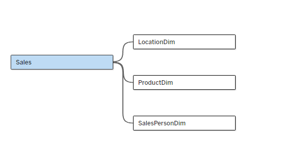
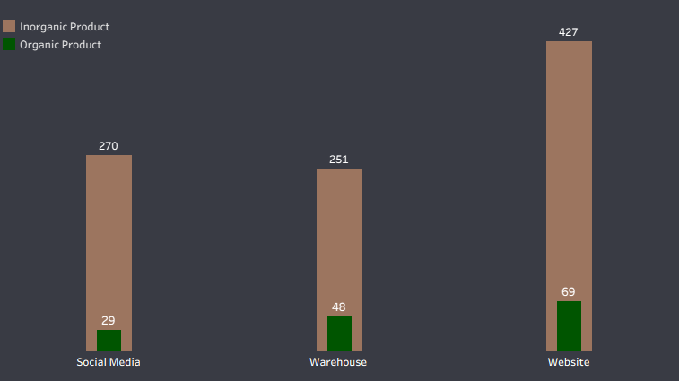
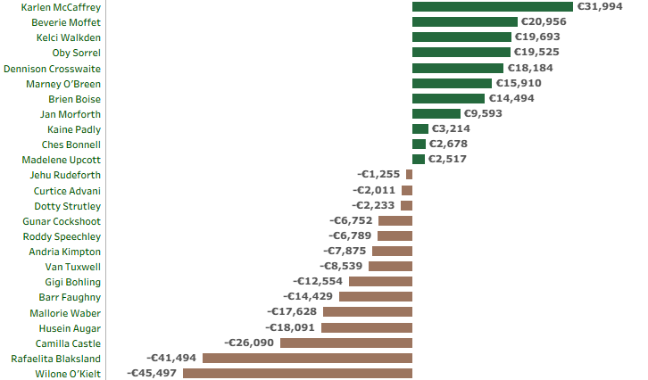

# Identifying-Profitability-Drivers-and-Value-Leakage-in-a-Multi-Channel-European-Sales-Organization

  

---

## Business Overview
**Choco de Luxe** is a premium artisanal chocolate brand headquartered in Brussels, Belgium, specializing in high-quality chocolate bars, bites, and confections. The company operates across multiple European cities and distributes its products through a diversified mix of retail boutiques, online platforms, and supermarket partnerships. As Choco de Luxe continues to expand its product portfolio and geographic footprint, the brand focuses on preserving artisanal quality standards while driving market share growth. To support sustainable expansion, the company adapts its product offerings and sales strategies based on regional performance insights and evolving customer preferences across European markets.

---

## Business Problem 
Despite strong product quality and a growing presence across Europe, Choco de Luxe lacks a unified, data-driven understanding of its commercial and operational performance. 

The key challenges include:

  1. Revenue & Profit Visibility Gaps
  2. Regional Underperformance Masked by Averages
  3. Unclear Sales Channel ROI
  4. Sales Agent Performance Imbalance
  5. Delivery Performance Not Driving Sales or Profitability Outcomes
  6. Product Mix Diluting Profitability

---

## Project Objectives
The objective of this project is to deliver a comprehensive, data-driven assessment of Choco de Luxe’s commercial performance across Europe, enabling leadership to identify value leakage, optimize execution, and support profitable growth.

Specifically, the project aims to:

**1. Evaluate Sales & Profit Performance Holistically**

Analyze revenue, profit, and volume trends across time, regions, and channels to uncover seasonality, growth patterns, and periods of underperformance.

**2. Identify Regional & City-Level Performance Gaps**

Compare sales volume, profitability, and delivery success across European locations to pinpoint underperforming markets masked by strong overall operational performance.

**3. Assess Sales Channel Effectiveness & ROI**

Measure the relative contribution of Website, Warehouse, and Social Media channels to revenue, profit, and quantity sold, including the impact of organic versus inorganic sales.

**4. Analyze Sales Agent Productivity & Profitability**

Evaluate individual agent performance using revenue, profit, transaction volume, delivery success rate, and average revenue/profit per agent to identify top performers, underperformers, and value leakage.

**5. Examine Delivery Performance as a Commercial Enabler**

Assess whether delivery reliability drives or limits sales performance by linking delivery success rates to revenue and agent productivity across regions.

**6. Optimize Product Mix & Margin Contribution**

Analyze profitability across product categories and lines to distinguish high-margin, value-driving products from high-volume, low-margin items that dilute overall performance.

**7. Enable Executive Decision-Making Through Interactive Dashboards**

Develop intuitive, interactive Tableau dashboards that allow business leaders to dynamically explore performance drivers, drill into problem areas, and support strategic decisions on pricing, product mix, channel investment, and salesforce management.

---

## Data Dictionary and Modelling
The dataset contains four different tables with multiple columns. The tables include: Sales Fact Table, LocationDim Table, SalesPersonDim Table, and ProductDim Table. 

**Sales Fact Table**
- TransactionID: A unique identifier assigned to each sales transaction
- Date: The date when the transaction occurred
- SalesPersonID: identifies who made the sale
- LocationID: indicating where the sale was made
- ProductID: the identifier of chocolate product sold
- Boxes Shipped: The number of boxes of chocolate shipped for the transaction
- Sales Channel: The platform or medium through which the product was sold, e.g., website, In-store
- Delivery Status: The state of delivery for the order, e.g., completed, cancelled

**LocationDim Table**
- LocationID: Unique identifier for each location
- Country: Country where the sale took place.
- City: Specific city of the sale/distribution center
- Region: geographical area or grouping of the city

**SalesPersonDim Table**
- SalesPersonID: Unique identifier for each salesperson
- SalesPerson Name: Full name of the salesperson
- Email: The official company email of the salesperson.
- Hire_Date: The date the salesperson joined the company.

**ProductDim Table**
- ProductID: A unique identifier for each product
- Product Name: The name of the chocolate product (e.g., 85% Dark Bars, Caramel Stuffed Bars)
- Category: The classification of the product based on its type (e.g., Dark Chocolate, Milk Chocolate)
- Cocoa Percent (%): The percentage of cocoa content in the chocolate product
- Cost per unit: The internal cost to produce one unit (box) of the product
- Price Per box: The selling price per box of the product
- Is_Organic: Indicates whether the product is made with organic ingredients (Yes/No)

  

---

## Approach & Methodology
This project was developed using **Microsoft Excel** and **Tableau**, covering the full analytics workflow from data cleaning and transformation to modeling, analysis, and visualization. The objective was to analyze Choco de Luxe’s sales performance across locations, sales channels, and product lines to identify performance patterns, operational inefficiencies, workforce and growth opportunities, and to deliver interactive Tableau dashboards that enable business leaders to make informed decisions on product positioning and channel strategy.

### 1. Data Cleaning & Transformation (Microsoft Excel)
- Imported raw customer data into **Excel**
- Performed data cleaning and transformation:
  - removed duplicates and filtered invalid or missing entries
  - renamed columns and standardized field formats (e.g., text, numeric, dates)
  - created **calculated columns** using VLOOKUP, XLOOKUP, IF, SUMIF, addition, subtraction, and multiplication   
- Ensured consistency and data quality for downstream modeling

### 2. DAX Measures (Tableau)
- Created **calculated fields** to support key metrics and business logic
- Applied dimensions and calculated measures to support dynamic and filter-aware analysis across sales, agents, and location segments

### 3. Interactive Visualization & Dashboard Design (Tableau)
Developed a comprehensive suite of interactive dashboards using **Tableau Dashboard**

### 4. Insight Generation & Business Alignment
- Identified key customer behavior patterns
- Translated findings into **actionable business recommendations**

---

## Live Dashboard
You can interact with the fully published Tableau dashboard here: 

🔗 [View on Tableau Public](https://public.tableau.com/shared/7XQCHSF6M?:display_count=n&:origin=viz_share_link)

---

## Sales Performance Analysis

  

### 1. Top KPIs (Key Performance Indicators)
- Total Transaction: 1094
- Total Products: 21
- No of Locations: 7
- Quantity Sold: 177,007
- Total Unit Cost: €2,873,176
- Total Revenue: €5,320,696
- Total Profit: €2,447,520
- Profit Margin%: 46%
- Delivery Success Rate%: 96%

**KPI Insights**

**Choco de Luxe** demonstrates strong overall commercial health, generating €5.32M in revenue and €2.45M in profit, resulting in a healthy 46% profit margin. The business operates efficiently at scale, evidenced by a 96% delivery success rate across 7 European locations, 21 products, and 177K+ units sold.

However, beneath these strong topline metrics lie material performance imbalances across regions, sales channels, and product profitability, which, if addressed, present a significant opportunity to unlock incremental growth without materially increasing operational complexity.

### 2. Regional & City Level Performance

  

  

**Analysis**

- Sales volume is unevenly distributed across locations
- Certain countries significantly outperform others in quantity sold
- Delivery success is uniformly high (93%–100%) across regions, meaning logistics is not the constraint

**Insight**

Underperformance in certain countries is commercial, not operational. Strong delivery execution masks weaker local demand, pricing fit, or sales coverage.

**Implication**

Leadership should not interpret high delivery success as market success. Sales strategy must be localized, not uniformly applied across regions.

### 3. Revenue & Profit Trend Analysis

**Analysis**

- Choco de Luxe recorded its highest revenue and profit at the start of the year in January, generating €821,720 in revenue and €377,987 in profit.
- Performance declined sharply in February, with revenue falling to €539,678, before recovering steadily over the following months. Revenue peaked again in June at €796,260, after which it declined gradually, closing the analyzed period in August at €622,851.
- Profit trends broadly follow revenue, but profit growth does not scale proportionally with revenue in all months.
- January shows strong revenue but relatively lower profit, suggesting early-year margin pressure (discounting, promotions, or cost inefficiencies).

  

**Insight**

Choco de Luxe exhibits seasonality and campaign-driven volatility, indicating that pricing, promotions, or cost structures are not consistently optimized throughout the year.

**Implication**

There is an opportunity to:
- Smooth revenue volatility
- Improve margin consistency through better campaign timing and pricing discipline

### 4. Sales Channel Effectiveness

**Channel Performance Breakdown**

**1. Website**
- Strategic Role: Primary growth engine
- Insight: Highest revenue, profit, and quantity sold

**2. Warehouse**
- Strategic Role: Stable secondary channel
- Insight: moderate revenue, lower profit efficiency

**3. Social Media**
  - Strategic Role: Emerging/support  channel
- Insight: Lowest volume but strategic brand value

  

  

**Key Observations**
- The Website channel dominates both revenue and profit, accounting for the largest share of units sold both in organic and inorganic produce.
- Warehouse sales deliver volume, but at lower profit efficiency
- Social Media contributes limited revenue and profit, but shows potential as a demand-generation channel

**Insight**

Not all channels are equally value-accretive. The Website channel is the core profit engine, while others should be optimized for either cost efficiency or demand stimulation.

### 5. Product Mix & Profit Margin Contribution

**Key Observations**
- Profit margin contribution varies widely across product categories
- Premium and specialty products (e.g., caramel chocolate, dark chocolate, filled chocolates, and flavored chocolate variants) contribute disproportionately higher margins of approximately 5% and above.
- Some high-volume products dilute overall margin, contributing between 3.58% and 4.66%

**Insight**

Revenue growth is currently driven by volume, but profit growth is driven by product mix quality.

**Implication**

Without deliberate product mix optimization, scaling volume alone will not maximize profitability.

  

---

## Agent Performance Analysis

  

**1. Top KPIs (Key Performance Indicators)**
- Total Transaction: 1094
- Qty Sold: 177,007 units across 21 products
- Sales Coverage: 25 agents across 7 locations
- Avg Revenue/Agent: €212, 827
- Avg Profit / Agent: €97,901
- Profit Margin: 46%
- Delivery Success Rate: 96%

**KPI Insights**

Choco De Luxe demonstrates strong overall commercial health, with €212.8k average revenue per agent, 46% profit margin, and an excellent 96% delivery success rate. However, performance is highly uneven across agents, with a small group materially outperforming while several agents destroy value (negative profit contribution when the target is €100,000). The core opportunity lies not in top-line growth alone, but in performance rebalancing, capability uplift, and selective intervention among underperformers.

**2. Agent Performance**

  

**Top Performers (Profit ≥ €100k target)**
- Karlen McCaffrey: €31,994 profit (clear benchmark agent)
- Beverie Moffet: €20,956
- Kelci Walkden: €19,693
- Oby Sorrel: €19,525
- Dennison Crosswaite: €18,184

➡ These five agents set the operational gold standard, delivering high revenue, strong margins, and consistent execution

**Underperformers (Profit ≥ €100k target)**

Several agents generate negative profit, despite selling measurable volumes:
- Wilone O’Kielt: –€45,497
- Rafaelia Blaksland: –€41,494
- Camilla Castle: –€26,090
- Hussein Algar: –€18,091
- Mallorie Waber: –€17,628

**Key Insight:**

Poor profitability is not driven by delivery failures (delivery success ~100%), but likely by:
- Poor product mix
- Discounting/price erosion
- High cost-to-serve customer

**3. Delivery Success ≠ Commercial Success** 

  

Agents with 100% delivery success (e.g., Rafaelia Blaksland, Wilone O’Kielt) still rank among the bottom contributors to revenue and profit.

This confirms that delivery excellence is necessary but not sufficient. The real gap is commercial effectiveness, not operations.

**4. Volume VS value Mismatch** 

  

- Bottom 5 agents by quantity sold still generate €118k - €179k in revenue
- Yet some of these same agents post negative profit when set at 100k or more

**Interpretation:**

Sales volume is being achieved at the wrong price or margin, signaling:
- Misaligned incentives
- Lack of margin discipline
- Poor customer portfolio quality

**5. Transaction Efficiency** 

  

Top agents achieve:
- High transaction counts (49-54 entries)
- High revenue per transaction (Totaling between €198k and €262k)
- Consistent profitability

Lower agents show:
- Reasonable transaction counts
- Weak monetization per transaction

➡ This indicates coaching and pricing governance gaps, not demand issues.

---

## Strategic Recommendations (Sales Performance)

1. **Double Down on the Website as the Primary Growth Engine**
- Increase marketing spend and personalization on the Website channel
- Prioritize high-margin products in online promotions
- Use Website data to test pricing and bundling strategies before rolling out to other channels

**Expected Impact:**

Higher ROI on marketing spend and faster profit growth without expanding logistics capacity.

2. **Implement Regional Commercial Playbook**
- Identify underperforming cities and diagnose:
  - Pricing mismatch
  - Product assortment gaps
  - Sales coverage issues
- Introduce region-specific promotions and product mixes

**Expected Impact:**

Improved regional d conversion rates and more balanced European performance

3. **Shift Focus from Volume-Led to Margin-Led Growth**
- Actively promote high-margin products across all channels
- Reassess low-margin, high-volume SKUs for:
  - Price increases
  - Cost optimization
  - Channel restriction

**Expected Impact:**

Margin expansion without needing incremental volume growth.

4. **Optimize Warehouse Channel for Cost Efficiency**
- Use Warehouse primarily for:
  - Bulk orders
  - Lower-margin, high-volume products
- Tighten cost controls and reduce discount leakage

**Expected Impact:**

Improved channel profitability and clearer channel roles.

5. **Use Delivery Excellence as a Commercial Differentiator**
- Integrate delivery success metrics into:
  - Sales messaging
  - B2B negotiations
  - Premium brand positioning

**Expected Impact:**

Stronger customer trust, higher repeat purchase rates, and pricing power.

6. **Introduce Advanced Performance Management**
- Move beyond static dashboards to:
  - Target vs actual tracking
  - Margin variance analysis
  - Scenario simulations (product mix, pricing, channel shifts)

**Expected Impact:**

Faster, more confident executive decision-making.

## Strategic Recommendations (Agent Performance)

1. **Replicate Top-Agent Playbooks**
- Shadow Karlen McCaffrey & Beverie Moffet
- Codify:
  - Product bundling strategies
  - Customer segmentation approach
  - Pricing tactics
- Roll out as mandatory sales enablement

2. **Immediate Performance Triage**

Classify agents into:
- **Scale (Top performers):** protect & incentivize
- **Fix (Low profit, decent volume):** targeted coaching
- **Exit / Reassign (Negative profit persistently):** decisive action

3. **Redesign Sales Incentives**
- Shift from revenue-only rewards to Profit-weighted commissions

This aligns agent behavior with company profitability.

4. **Product Mix Governance**
- Identify high-margin SKUs
- Mandate minimum mix ratios
- Prevent agents from pushing low-margin products unchecked

---

## Executive Summary 

Choco de Luxe delivered a strong overall performance, generating €5.32M in revenue and €2.45M in profit at a 46% margin across seven European markets, supported by a highly reliable 96% delivery success rate and an average €212.8K revenue per sales agent. Sales exhibit clear seasonality, with an early-year decline followed by a mid-year recovery and softening toward the end of the period, while revenue and profit remain heavily concentrated in the Website channel, with Warehouse and Social Media providing lower but stable contributions. Despite operational strength, commercial performance is uneven across regions and agents, with premium products and a small group of high-performing sales agents driving the majority of profitability, while several agents generate negative profit (when Profit target ≥ €100k) due to pricing, product mix, and deal structure inefficiencies, indicating that current revenue growth masks underlying value leakage driven by commercial execution rather than delivery or operational constraints.

Choco de Luxe is operationally strong and financially healthy, but the next phase of growth depends on precision rather than scale. The biggest upside lies in channel prioritization, regional commercial tailoring, and margin-led product strategy, not in expanding footprint or logistics capacity.

---

## Connect With Me
- 💼 **LinkedIn:** (https://www.linkedin.com/in/david-okeleye001/)
- 📧 **Email:** okeleyedavid2021@gmail.com
- 🌐 **Portfolio:** https://bit.ly/3N5c1p7
- 🐙 **GitHub:** https://github.com/olavidz01-dev
